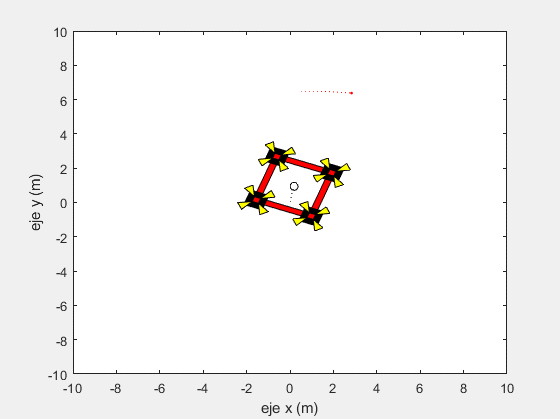
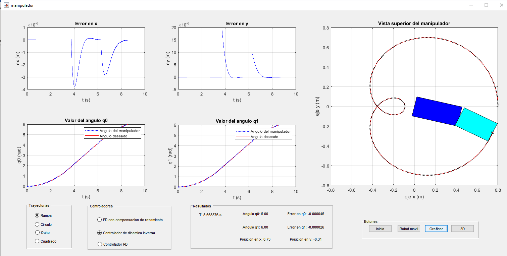
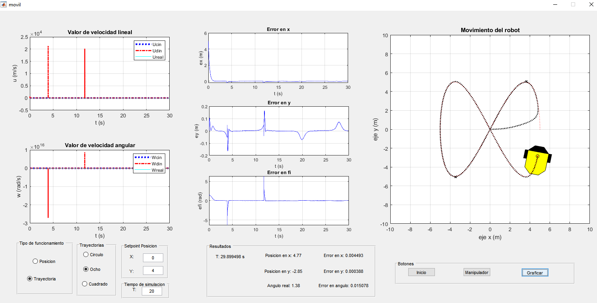

# MATLAB Projects
<!-- markdownlint-disable MD033 -->
<!-- markdownlint-disable MD047 -->
## 1. Kinematic controls with  low compute algorithms

These codes are in the ComputingControl folder. Only press play  in the GUIControl file and can see the simple interface. This file has a PD, PID-D and SMC control for trajectory control, you have to put the initial position de robot, kind of control, kind of trajectory, tuning constants, kind of GUI robot and its color.

The animation shows when the robot moves with a SMC control.

  

## 2. Control of Manipulator Robot

These codes are in the ManipulatorControl folder. Only press play  in the manipulador.m file and can see the GUI as shows in the figure.

  

The simulation is based in BOSCH manipulator. You can chose between differents kind of control and trajectories.

## 3. Control of Moblie Robot

These codes are in the MobileControl folder. Only press play  in the movil.m file and can see the GUI as shows in the figure.

  

The simulation is based in PIONNER AT robot. You can chose between posture control or trajectory control and  you can chose differents trajectories.

## 4. Contact with me

Linkedin: <www.linkedin.com/in/juan-balseca-pinto-9117b397>